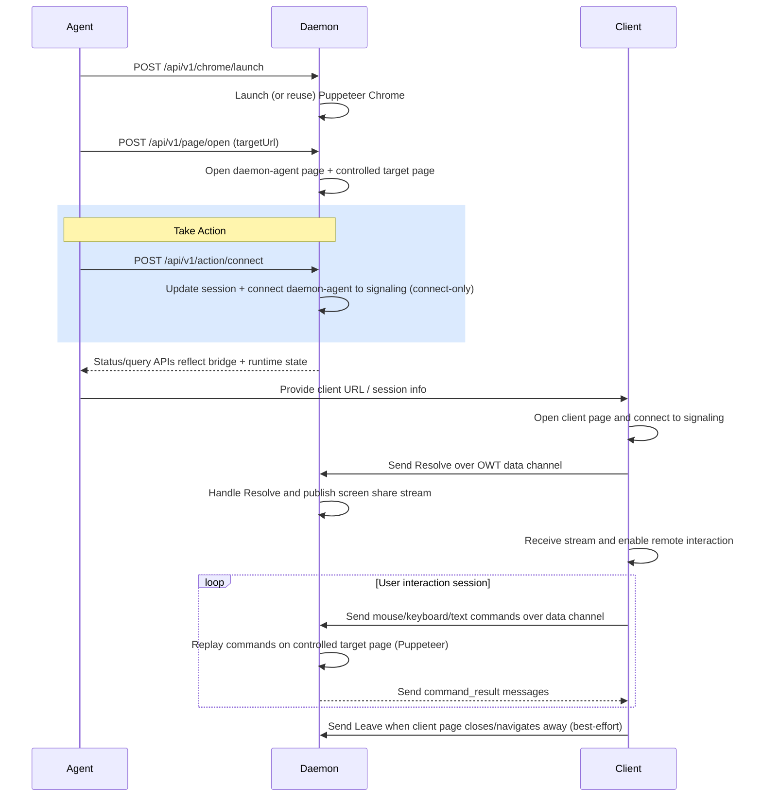

# agentic-browser-lui

Node.js pnpm workspace for an agentic browser P2P system with three sub-projects:

- `packages/daemon`: Daemon endpoint tooling, local CLI, daemon-side WebRTC page, and REST bridge for browser control.
- `packages/client`: Client SDK and demo UI that receives daemon video stream and sends operation commands via data channel.
- `packages/agent`: Agent control page that calls daemon REST APIs (`connect`, `share/start`, `share/stop`, `page/open`, `chrome/launch`, and so on).

## Project Layout

- `packages/daemon/public`: daemon operator UI (`daemon-agent.html`) and browser entrypoint (`daemon-agent.js`).
- `packages/daemon/src`: daemon CLI/server/runtime code, including REST endpoints.
- `packages/client/src/sdk`: reusable client SDK pieces, including the main client wrapper and viewer/pointer helpers used by the demo.
- `packages/client/src/demo`: demo UI wired on top of the SDK exports.
- `packages/agent/public/agent.html`: standalone agent action page.
- `packages/agent/src/demo`: agent action handlers for daemon REST orchestration.

## Prerequisites

- Node.js 20+
- pnpm 9+

## Upstream References

- OWT signaling sample server: [open-webrtc-toolkit/owt-server-p2p](https://github.com/open-webrtc-toolkit/owt-server-p2p)
- OWT JavaScript SDK: [open-webrtc-toolkit/owt-client-javascript](https://github.com/open-webrtc-toolkit/owt-client-javascript)

## Setup

1. Install dependencies:
   - If Chromium download is blocked in your network, set env then install:
     - PowerShell: `$env:PUPPETEER_SKIP_DOWNLOAD='true'; pnpm install`
   - Otherwise:
     - `pnpm install`
2. Prepare daemon runtime env:
   - PowerShell: `Copy-Item packages/daemon/.env.example packages/daemon/.env`
   - Edit `packages/daemon/.env` with your local values.
3. Prepare client runtime env:
   - PowerShell: `Copy-Item packages/client/.env.example packages/client/.env`
   - Edit `packages/client/.env` with your local values.
4. Prepare agent runtime env:
   - PowerShell: `Copy-Item packages/agent/.env.example packages/agent/.env`
   - Edit `packages/agent/.env` with your local values.

## Start External OWT Signaling Server

1. In your `owt-server-p2p` repository:
   - `npm install`
   - `node src/index.js`
2. Keep it running (default plain URL is `http://localhost:8095`, secure URL is `https://localhost:8096`).

## Run

1. Start daemon static server and peer page runtime:
   - `pnpm start:daemon`
2. Start client demo static server:
   - `pnpm start:client`
3. Start standalone agent static server:
   - `pnpm start:agent`
4. Open daemon peer page URL printed by daemon startup (default `http://127.0.0.1:8788/daemon-agent.html?...`).
5. In daemon peer page:
   - Ensure signaling host points to your OWT signaling server (for example `http://localhost:8095`).
   - Click `Connect`, then click `Share Screen` and choose the browser tab/page that will receive remote input.
6. Open client demo URL printed by client startup (default `http://127.0.0.1:5174/client.html`).
7. Open agent page URL printed by agent startup (default `http://127.0.0.1:5175/agent.html`).
8. In agent page:
   - Ensure `Daemon API URL` points to daemon static server (`http://localhost:8788`).
   - Use `Launch Chrome`, `Open Target`, `Take Action`, `Start Sharing`, `Stop Sharing`, `Close Page`, and `Exit Chrome`.
9. In client demo:
   - Ensure `Signaling URL` is OWT signaling server (`http://localhost:8095`).
   - Ensure `Daemon API URL` points to daemon static server (`http://localhost:8788`).
   - Click `Connect`.
   - Use viewer mouse and text controls to send commands to daemon.
   - Drag operations are supported through the shared viewer using `mouse_down`, `mouse_move`, and `mouse_up` command replay.

## Alternative Dev Mode

- `pnpm dev:daemon`: runs daemon process.
- `pnpm dev:client`: runs Vite dev server for client demo (default `http://localhost:5173`).
- `pnpm dev:agent`: runs agent static server.
- `pnpm dev`: runs daemon, client, and agent together.

## Core flow

## Refactoring Notes

- Client-side viewer geometry and mouse-command helpers were moved from the demo into `packages/client/src/sdk/viewerUtils.js` and re-exported by `packages/client/src/sdk/index.js`.
- Agent control actions are maintained in the standalone `packages/agent` package.

## Daemon REST API Overview

Daemon now exposes REST APIs on the static server (default `http://localhost:8788`) for Agent-driven orchestration:

- `POST /api/v1/chrome/launch`
  - Launches (or reuses) the daemon browser runtime through Puppeteer.
  - Optional body can include Chrome executable path and launch args.
- `POST /api/v1/page/open`
  - Opens or navigates the daemon-controlled target page.
  - For agent workflow, this also prepares daemon-agent session context.
- `POST /api/v1/action/connect`
  - Primary "Take Action" endpoint.
  - Updates daemon-agent session (IDs, signaling, ICE), performs signaling connect-only.
- `POST /api/v1/share/start`
  - Starts share flow by enqueueing daemon-agent connect + share.
  - Useful when you want immediate publish without separate connect step.
- `POST /api/v1/share/stop`
  - Stops active sharing by enqueueing daemon-agent disconnect.
  - Call `share/start` again for a fresh share session after stop.
- `POST /api/v1/page/close`
  - Closes the currently controlled target page.
- `POST /api/v1/chrome/exit`
  - Exits Puppeteer-launched browser process and clears active browser/page state.
- `GET /api/v1/status`
  - Returns daemon runtime snapshot (browser/page state, target status, and bridge state).

Internally, daemon-agent page polls `/api/v1/agent/commands` and reports execution via `/api/v1/agent/events`.

Runnable curl workflow example is available at `tests/scripts/daemon-rest-api-curl.sh`.

## Notes

- Signaling logic in daemon peer page and client follows `peercall.js`/`sc.websocket.js` pattern (`authentication`, `owt-message`, reconnect handling).
- OWT SDK in this workspace is loaded from vendored browser files at `packages/client/public/vendor/owt.js` and `packages/daemon/public/vendor/owt.js`.
- Socket.IO is also vendored locally in both daemon and client public assets so signaling does not depend on a CDN-hosted global `io` script.
- Daemon and client both provide local static file servers to host demo pages over `http://`.
- Automatic web page capture without user prompt depends on browser/OS policies; this scaffold includes the full data and signaling path and supports manual screen selection.
- Client mouse coordinates are scaled from rendered video size to source stream resolution before sending `mouse_move` and `mouse_click` commands.
- Optional smoke test: `pnpm test:signal` uses a root-level Node `socket.io-client` dependency to verify signaling auth and `owt-message` relay.
<!-- eof -->
