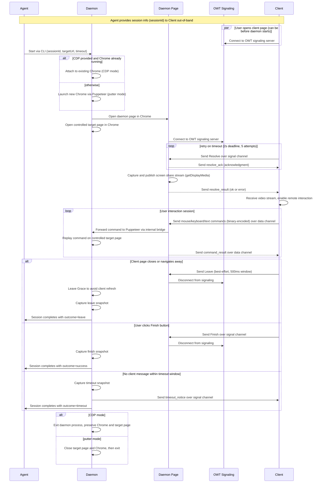

# Direct User Control

Node.js pnpm workspace for an direct user control P2P system with two sub-projects:

- `packages/daemon`: Daemon endpoint tooling, local CLI, and daemon-side WebRTC page for browser control.
- `packages/client`: Client SDK and UI that receives daemon video stream and sends operation commands via data channel.

## Project Layout

- `packages/daemon/public`: daemon control UI (`daemon.html`) and browser entrypoint (`daemon.js`).
- `packages/daemon/src`: daemon CLI/server/runtime code.
- `packages/client/src/sdk`: reusable client SDK pieces, including the main client wrapper and viewer/pointer helpers used by the UI.
- `packages/client/src`: UI wired on top of the SDK exports.

## Prerequisites

- Node.js 20+
- pnpm 9+

## Upstream References

- OWT signaling sample server: [open-webrtc-toolkit/owt-server-p2p](https://github.com/open-webrtc-toolkit/owt-server-p2p)
- OWT JavaScript SDK: [open-webrtc-toolkit/owt-client-javascript](https://github.com/open-webrtc-toolkit/owt-client-javascript)

## Setup

1. Install dependencies:
   - If Chromium download is blocked in your network, set env then install:
     ```bash
     export PUPPETEER_SKIP_DOWNLOAD=true
     pnpm install
     ```
   - Otherwise:
     ```bash
     pnpm install
     ```
2. Prepare daemon runtime env:
   ```bash
   cp packages/daemon/.env.example packages/daemon/.env
   # Edit packages/daemon/.env with your local values
   ```
3. Prepare client runtime env:
   ```bash
   cp packages/client/.env.example packages/client/.env
   # Edit packages/client/.env with your local values
   ```

## Start External OWT Signaling Server

1. In your `owt-server-p2p` repository:
   - `npm install`
   - `node src/index.js`
2. Keep it running (default plain URL is `http://localhost:8095`, secure URL is `https://localhost:8096`).

## Setup STUN and TURN Servers (Optional)

For production or network scenarios where direct P2P is blocked, configure STUN/TURN servers using **coturn** on Ubuntu:

1. Install coturn:
   ```bash
   sudo apt-get update
   sudo apt-get install coturn
   ```

2. Create coturn config file (e.g., `/etc/coturn/turnserver.conf`):
   ```bash
   sudo tee /etc/coturn/turnserver.conf > /dev/null << 'EOF'
   listening-port=80
   tls-listening-port=443
   proto=tcp
   alt-listening-port=3478
   alt-tls-listening-port=5349
   listening-ip=0.0.0.0
   min-port=49152
   max-port=65535
   fingerprint
   lt-cred-mech
   user=username:key
   realm=example.com
   cert=/et/turn_server_cert.pem
   pkey=/etc/turn_server_pkey.pem
   log-file=/var/log/coturn/turnserver.log
   no-multicast-peers
   no-rfc5780
   no-stun-backward-compatibility
   response-origin-only-with-rfc5780
   EOF
   ```

3. Start coturn:
   ```bash
   sudo systemctl start coturn
   sudo systemctl enable coturn  # Enable on boot
   ```

4. Configure STUN/TURN in client and daemon:
   - Set in `.env` files:
     - `packages/client/.env`: `STUN_SERVER_URLS`, `TURN_SERVER_URLS`, `TURN_USERNAME`, `TURN_CREDENTIAL`
     - `packages/daemon/.env`: Same environment variables
   - Or in runtime config JSON files (`client.runtime.json`, `daemon.config.json`)

## Run

The daemon is started via CLI by the agent orchestrator. There are two runtime modes:

### Mode 1: CDP (Attach to Existing Chrome)

Use this when Chrome is already running with CDP enabled.

**Setup:**
1. Pre-launch Chrome with remote debugging enabled:
   ```bash
   google-chrome \
     --remote-debugging-port=9222 \
     --user-data-dir=/tmp/chrome-profile \
     --allow-http-screen-capture \
     --auto-select-tab-capture-source-by-title \
     --auto-select-desktop-capture-source
   ```

2. Start client static server:
   ```bash
   pnpm start:client
   ```

3. Start daemon via CLI with `--remote-debugging-port`:
   ```bash
   node packages/daemon/src/cli.js \
     --sessionId test \
     --remote-debugging-port 9222 \
     --timeout 300 \
     --targetUrl http://localhost:8080/target-demo.html
   ```

4. Open client URL:
   - Default: `http://127.0.0.1:5174/direct-user-control.html?sessionId=test&scrollRate=100`

### Mode 2: putter (Auto-launch Chrome)

Use this when you want the daemon to launch Chrome automatically via Puppeteer. CDP mode will fallback to this mode when failed to attach to the existing Chrome.

**Setup:**
1. Start client static server:
   ```bash
   pnpm start:client
   ```

2. Start daemon via CLI without `--remote-debugging-port`:
   ```bash
   node packages/daemon/src/cli.js \
     --sessionId test \
     --timeout 300 \
     --targetUrl http://localhost:8080/target-demo.html
   ```

3. Daemon automatically launches Chrome, opens daemon page, and opens target page

4. Open client URL:
   - Default: `http://127.0.0.1:5174/direct-user-control.html?sessionId=test&scrollRate=100`

**Mode Behavior:**
- **CDP**: Daemon exits but preserves Chrome and target page (useful for manual inspection)
- **putter**: Daemon closes Chrome and target page on exit (clean shutdown)

## Headless Mode for Full Page Capture

For production or resource-constrained environments, enable headless mode to capture the full target page without UI overhead.

**Configuration (in `.env`):**
```bash
BROWSER_HEADLESS=true
TARGET_PAGE_WIDTH_MAX=1920
TARGET_PAGE_HEIGHT_MAX=1080
DAEMON_ENABLE_HEADLESS_CALIBRATION=true
```

**Key features:**
- Full page width is guaranteed to be visible (no horizontal scroll on client)
- Vertical scroll allows viewing entire page height
- GPU not required (runs on servers without display)
- Ideal for headless server deployments


## Development Mode

Run development servers with live reload:

```bash
# Run all services together
pnpm dev

# Or run individually
pnpm dev:daemon      # Daemon with auto-restart
pnpm dev:client      # Vite dev server (http://localhost:5173)
```

## Core flow



## Notes

- Signaling logic in daemon peer page and client follows `peercall.js`/`sc.websocket.js` pattern (`authentication`, `owt-message`, reconnect handling).
- OWT SDK in this workspace is loaded from vendored browser files at `packages/client/public/vendor/owt.js` and `packages/daemon/public/vendor/owt.js`.
- Socket.IO is also vendored locally in both daemon and client public assets so signaling does not depend on a CDN-hosted global `io` script.
- Daemon and client both provide local static file servers to host pages over `http://`.
- Automatic web page capture without user prompt depends on browser/OS policies; this scaffold includes the full data and signaling path and supports manual screen selection.
- Client mouse coordinates are scaled from rendered video size to source stream resolution before sending `mouse_move` and `mouse_click` commands.
- Optional smoke test: `pnpm test:signal` uses a root-level Node `socket.io-client` dependency to verify signaling auth and `owt-message` relay.
<!-- eof -->
